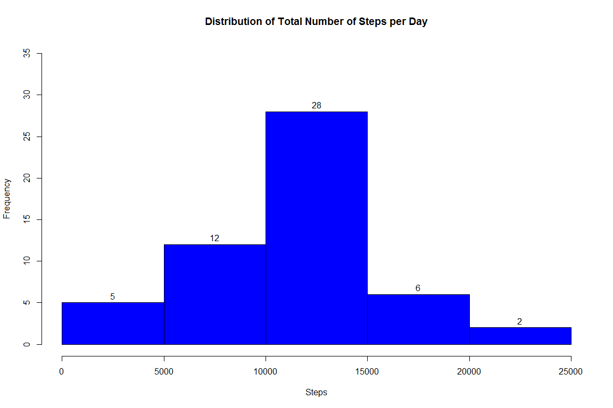
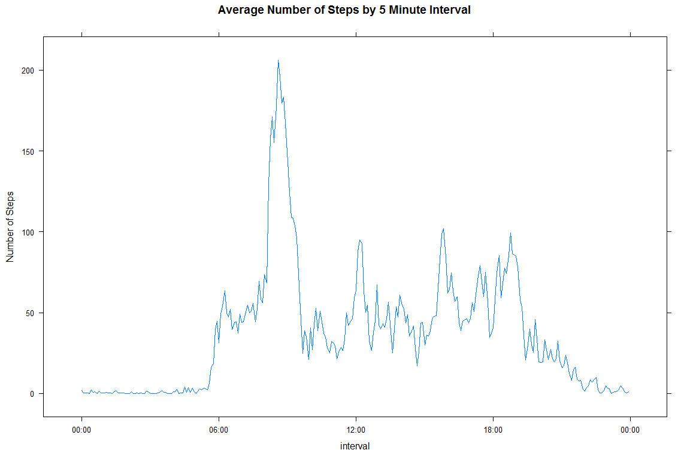
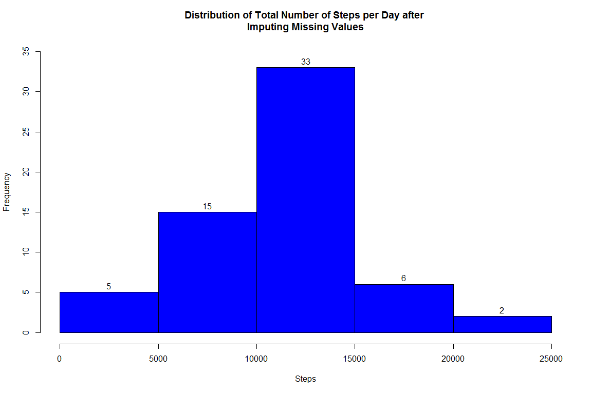
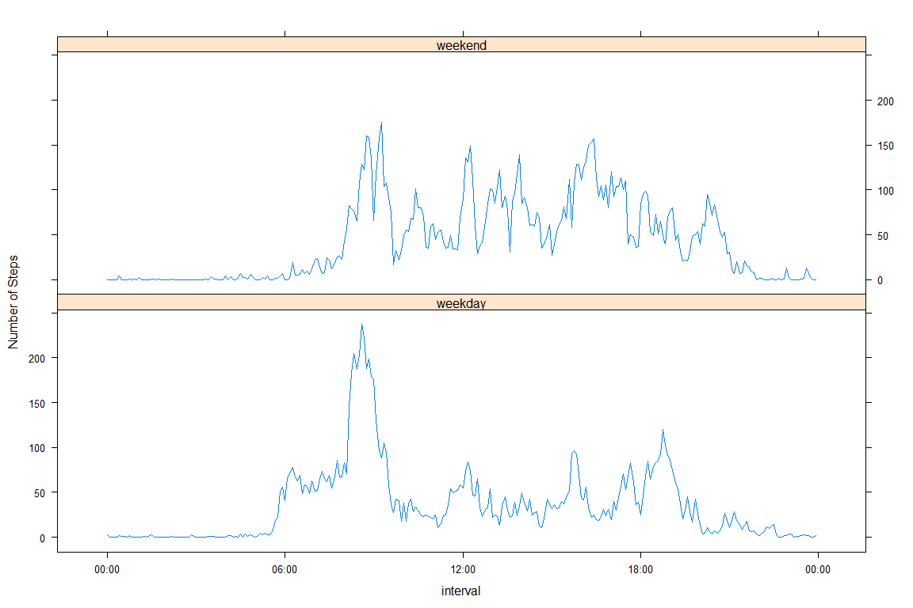

# Reproducible Research: Peer Assessment 1

========================================================
## 1. Loading and processing the data:

Firstly, the required libraries are loaded and the raw data is read into a data.table 
using the fread command. 

```r
library(data.table)
library(lubridate)
```

```
## 
## Attaching package: 'lubridate'
## 
## The following objects are masked from 'package:data.table':
## 
##     hour, mday, month, quarter, wday, week, yday, year
```

```r
library(knitr)
library(lattice)

setwd("y:/coursera/Reproducible Research/Project 1")

opts_chunk$set(fig.width=12, fig.height=8, fig.path='figures/',
               echo=FALSE, warning=FALSE, message=FALSE)

## Read in data from csv file
data_dt<-fread("activity.csv",sep=",",na.strings="NA")
```


After this the data is processed, ie. the date is converted to the date format using 
the lubridate ymd functions and a weekday field is added. 
The interval is converted to a datetime to facilitate smooth charting later ( eliminate sawtooth ).
The data is then split into two data.tables with valRows_dt containing those records which have a 
valid value for steps and invRows_dt containing the records where steps is NA.


```r
data_dt$date<-ymd(data_dt$date)
data_dt$weekday<-wday(data_dt$date)
data_dt$interval<-as.POSIXct(strptime(sprintf("%04d",data_dt$interval),"%H%M"))

valRows_dt<-data_dt[!is.na(data_dt$steps),]
invRows_dt<-data_dt[is.na(data_dt$steps),.(date,interval,weekday)]
```
## 2. Calculation of mean, median and total steps taken per day and making a histogram of total steps

The total steps taken per day are calculated and stored in the data table named 
daydata_dt. The mean and median number of steps per day are then calculated.

```r
setkey(valRows_dt,date)
daydata_dt<-valRows_dt[,list(Total=sum(steps)),by="date"]
daydat_summ<-daydata_dt[,list(Mean=mean(Total), Median=median(Total))]
```
**The mean number of steps per day is 10766.2**.
**The median number of steps per day is 10765**.


Using the daydata_dt data table, a histogram of the total steps taken per day is made.

```r
hist(daydata_dt$Total,labels=TRUE,ylim=c(0,35), main="Distribution of Total Number of Steps per Day",col = 
"blue", xlab="Steps")
```

 

## 3. Average daily pattern

The mean steps taken in all days for each interval is calculated and stored in the 
data table named perioddata_dt.

```r
setkey(valRows_dt,interval)
perioddata_dt<-valRows_dt[,list(Mean=mean(steps)),by="interval"]
```
The required time series plot is made using the perioddata_dt data table.

```r
xyplot(Mean~interval,perioddata_dt ,type="l",main="Average Number of Steps by 5 Minute Interval",ylab="Number of Steps",scales = list(x = list(format = "%H:%M")))
```

 

The interval that has the maximum value of the mean steps taken is found by ordering 
the perioddata_dt data.table by the number of steps and creating a data frame 
MaxInterval with the last record.

```r
setkey(perioddata_dt,Mean)
MaxInterval<-(tail(perioddata_dt,1))
```

**The 5-minute interval, on average across all the days in the dataset, that contains 
the maximum number of steps is 08:35**.

## 4. Inputting missing values

The total number of missing values in the given dataset is found by counting the 
number of rows in the invRows_dt data.table

**The number of missing values in the dataset is 2304**.

The missing values are corrected by calculating the mean number of steps for each 
day of the week for each period. ( The weekday is already in the data.tables). The records in 
the invRows_dt data.table are then updated with the mean number of steps for that 
weekday and period.  Finally the valRows_dt and invRows_dt data.tables are merged to 
give a complete data.table data1_dt.


```r
## Index the two tables by interval and weekday
setkey(invRows_dt,interval,weekday)
setkey(valRows_dt,interval,weekday)

## Now create a table with the average number of steps for each interval on each weekday

period_avg_dt<-valRows_dt[,list(steps=mean(steps)),by="interval,weekday"]

## Now add a steps column to the invRows1_dt data.table and populate with the mean for 
## valid observations for same period and weekday
invRows1_dt<-period_avg_dt[invRows_dt]

## Append the the updated table to the table of observations which had valid steps values

data1_dt<-rbind(valRows_dt,invRows1_dt )
```
For this new data frame that has no missing values, the total steps taken each day is 
calculated. This is stored in the data table named daydata1_dt.

```r
setkey(data1_dt,date)
daydata1_dt<-data1_dt[,list(Total=sum(steps)),by="date"]
daydat1_summ<-daydata1_dt[,list(Mean=mean(Total), Median=median(Total))]
```

**The mean number of steps per day is 10821.2**.
**The median number of steps per day is 11015**.

**The mean has increased by 0.5 % and the median by 2.3 % **.

Using this data table, a histogram of the total steps taken per day is made.

```r
hist(daydata1_dt$Total,ylim=c(0,35),labels=TRUE, main="Distribution of Total Number of Steps per Day after 
Imputing Missing Values",col = "blue", xlab="Steps")
```

 

## 5. Activity patterns on weekdays and weekends

A variable called DayType is created which has 7 factors with days 1 and 7 being weekend and days 2-6 are weekday.
A daytype column is then added to data1_dt and populated with the appropriate value from DayType based on the value in the existing weekday field in data_dt

```r
DayType<-as.factor(c("weekend","weekday","weekday","weekday","weekday","weekday","weekend"))
data1_dt$daytype<-(DayType[data1_dt$weekday])
```
We create a summary data table perioddata_dt which contains the average steps for each period for each daytype.


```r
setkey(data1_dt,daytype,interval)
perioddata_dt<-data1_dt[,list(Mean=mean(steps)),by="daytype,interval"]
```

Finally, a plot containing a time series plot of the 5-minute interval (x-axis) 
and the average number of steps taken, averaged across all weekday days or weekend 
days (y-axis) is made. 


```r
xyplot(Mean~interval|daytype,perioddata_dt ,type="l",layout=c(1,2),ylab="Number of Steps",scales = list(x = list(format = "%H:%M")))
```

 

It can be seen that the activity pattern on weekdays and weekends show significant  
differences, particularly in early morning and late evening.
